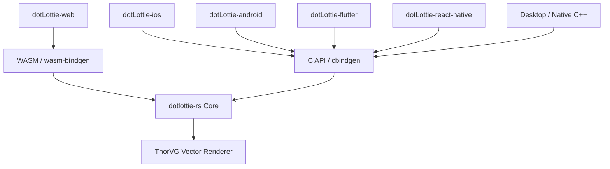

# dotLottie Rust (`dotlottie-rs`) Guide

`dotlottie-rs` is the cross-platform dotLottie runtime written in Rust. It serves as the core rendering and execution engine powering all official dotLottie players with guaranteed visual consistency across platforms via the ThorVG vector graphics engine.



---

## 1. Rust Installation & Cargo Dependency

Add `dotlottie-rs` as a git dependency in `Cargo.toml`:

```toml
[dependencies]
dotlottie-rs = { git = "https://github.com/LottieFiles/dotlottie-rs", features = [
    "tvg",              # ThorVG renderer
    "tvg-cpu",          # Software rendering backend
    "tvg-png",          # Embedded PNG support
    "tvg-jpg",          # Embedded JPEG support
    "tvg-ttf",          # TrueType font support
    "state-machines",   # State machine execution engine
    "theming",          # Dynamic slot theming
] }
```

### Key Cargo Features

| Feature | Description |
|---|---|
| `tvg` | Enables ThorVG vector rasterizer |
| `tvg-cpu` | High-efficiency software CPU renderer |
| `tvg-png` / `tvg-jpg` / `tvg-ttf` | Image and font decoder sub-features |
| `c_api` | Exposes C bindings (cbindgen headers for native FFI) |
| `wasm-bindgen-api` | Exposes WebAssembly bindings for web browsers and Node.js |
| `state-machines` | Enables declarative interactivity and state graph processing |
| `theming` | Dynamic slot overriding and theme transformations |
| `audio` | Embedded audio playback synchronization |

---

## 2. Core Rust API Usage

```rust
use dotlottie_rs::{
    player::{Mode, Player},
    layout::{Fit, Layout},
    renderer::Renderer,
};

fn main() -> Result<(), Box<dyn std::error::Error>> {
    // 1. Initialize Player configuration
    let mut player = Player::new(
        Default::default(), // Config: autoplay, loop, speed, mode
    );

    // 2. Load .lottie binary data or JSON
    let animation_data = std::fs::read("animation.lottie")?;
    let width = 500;
    let height = 500;
    
    player.load_dotlottie_data(&animation_data, width, height)?;

    // 3. Set layout scaling
    player.set_layout(Layout {
        fit: Fit::Contain,
        align: (0.5, 0.5), // Center aligned
    });

    // 4. Playback and Frame Rendering
    player.play();

    // Allocate RGBA pixel buffer (width * height * 4)
    let mut buffer = vec![0u8; (width * height * 4) as usize];
    
    // Advance tick (e.g. 16ms for 60fps)
    player.tick(0.016);

    // Render current frame into buffer
    let did_render = player.render(&mut buffer, width, height);
    if did_render {
        // Buffer now contains raw RGBA pixels ready for canvas, texture, or file saving
    }

    Ok(())
}
```

---

## 3. Native C API Integration

For Android (NDK), iOS (Objective-C/Swift), Flutter FFI, or desktop C/C++:

### Header & Library Generation
```bash
# Build native static and dynamic libraries + C headers
make native
```

### C Lifecycle & Playback Loop

```c
#include "dotlottie_player.h"
#include <stdlib.h>
#include <stdio.h>

int main() {
    // 1. Create player instance
    Config config = {
        .autoplay = true,
        .loop_animation = true,
        .mode = Mode_Forward,
        .speed = 1.0f,
        .use_frame_interpolation = true,
    };
    DotLottiePlayer* player = dotlottie_player_new(config);

    // 2. Load animation file
    uint32_t width = 800;
    uint32_t height = 600;
    dotlottie_player_load_dotlottie_data(player, data_bytes, data_len, width, height);

    // 3. Allocate render surface buffer (RGBA: 4 bytes per pixel)
    uint32_t* buffer = (uint32_t*)malloc(width * height * 4);

    // 4. Render loop
    while (dotlottie_player_is_playing(player)) {
        dotlottie_player_tick(player, 0.016f);
        if (dotlottie_player_render(player, buffer, width, height)) {
            // Present buffer to screen or GPU texture
        }
    }

    // 5. Clean up memory
    free(buffer);
    dotlottie_player_destroy(player);
    return 0;
}
```

---

## 4. State Machine Engine

State machines declare interactive states, transitions, listeners, and conditions:

```rust
// Fire interactive events (e.g., user click, hover, custom triggers)
player.state_machine_fire_event("click");
player.state_machine_fire_event("hover");

// Set dynamic input conditions
player.state_machine_set_numeric_input("scroll_progress", 0.75);
player.state_machine_set_boolean_input("is_active", true);
player.state_machine_set_string_input("theme_mode", "dark");
```

---

## 5. Dynamic Slot Overrides & Theming

Override properties at runtime without modifying the source animation:

```rust
use dotlottie_rs::renderer::{ColorSlot, ScalarSlot, TextSlot, TextDocument};

// 1. Color Slot Override (RGBA 0.0 - 1.0)
player.set_color_slot("primary-color", ColorSlot {
    color: [0.1, 0.5, 0.9, 1.0],
});

// 2. Scalar Slot Override (Opacity, Rotation, Stroke Width)
player.set_scalar_slot("stroke-width", ScalarSlot {
    value: 4.0,
});

// 3. Text Slot Override
player.set_text_slot("user-name", TextSlot {
    document: TextDocument {
        text: "Alex".to_string(),
        font_size: 32.0,
        fill_color: [1.0, 1.0, 1.0, 1.0],
        ..Default::default()
    },
});
```

---

## 6. Cross-Platform Build Commands

```bash
make setup              # Check & configure build toolchains
make wasm               # Build WebAssembly (CPU software rasterizer)
make wasm-webgl         # Build WebAssembly with WebGL2 acceleration
make wasm-webgpu        # Build WebAssembly with WebGPU acceleration
make android            # Build Android ARM64, ARMv7, x86_64, x86
make apple              # Build macOS, iOS, tvOS, visionOS
make windows-x86_64     # Build native Windows 64-bit binaries
make test               # Run comprehensive test suite
```
